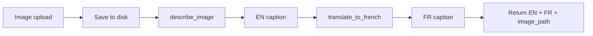

# Prediction API

## How it works



## AI Model

The prediction pipeline has two steps:

**Step 1 — Image description** (`AI_Model/Model_service.py`)

`describe_image(image_bytes)` takes raw image bytes and returns an English description using your custom vision model.

**Step 2 — Translation** (`AI_Model/Model_service.py`)

`translate_to_french(text)` sends the English description to Groq and returns the French translation.

## Image Storage

Images are saved to `static/uploads/{user_id}/{uuid}{ext}` and served as static files by FastAPI. Each user's images are stored in their own folder identified by their database ID.

```
static/
└── uploads/
    ├── 1/               ← user id=1
    │   ├── a3f8c2d1.jpg
    │   └── b7e9f4a2.png
    └── 2/               ← user id=2
        └── c1d2e3f4.jpg
```