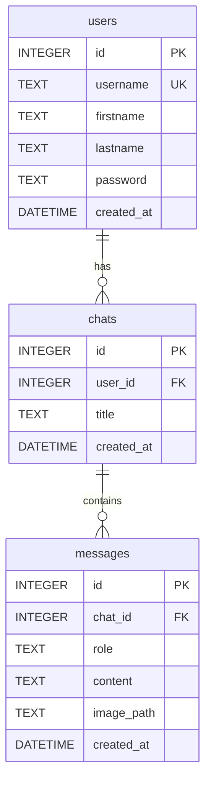

# Database Schema

## Entity Relationship Diagram

## Table Definitions

### users

| Column | Type | Constraints | Description |
|---|---|---|---|
| `id` | INTEGER | PRIMARY KEY AUTOINCREMENT | Unique user ID |
| `username` | TEXT | NOT NULL UNIQUE | Login username |
| `firstname` | TEXT | NOT NULL | First name |
| `lastname` | TEXT | NOT NULL | Last name |
| `password` | TEXT | NOT NULL | SHA-256 hashed password |
| `created_at` | DATETIME | DEFAULT CURRENT_TIMESTAMP | Registration time |

### chats

| Column | Type | Constraints | Description |
|---|---|---|---|
| `id` | INTEGER | PRIMARY KEY AUTOINCREMENT | Unique chat ID |
| `user_id` | INTEGER | FK → users.id | Owner of the chat |
| `title` | TEXT | NOT NULL | First message or image name |
| `created_at` | DATETIME | DEFAULT CURRENT_TIMESTAMP | Creation time |

### messages

| Column | Type | Constraints | Description |
|---|---|---|---|
| `id` | INTEGER | PRIMARY KEY AUTOINCREMENT | Unique message ID |
| `chat_id` | INTEGER | FK → chats.id | Parent chat |
| `role` | TEXT | CHECK IN ('user','ai') | Who sent the message |
| `content` | TEXT | NOT NULL | Text or JSON `{en, fr}` |
| `image_path` | TEXT | DEFAULT NULL | `/static/uploads/{user_id}/{uuid}.jpg` |
| `created_at` | DATETIME | DEFAULT CURRENT_TIMESTAMP | Send time |

!!! note "Content format"
    - For `role = 'user'`: `content` is the user's text or image filename
    - For `role = 'ai'`: `content` is a JSON string `{"en": "...", "fr": "..."}`
    - `image_path` is only set on user messages that included an image upload