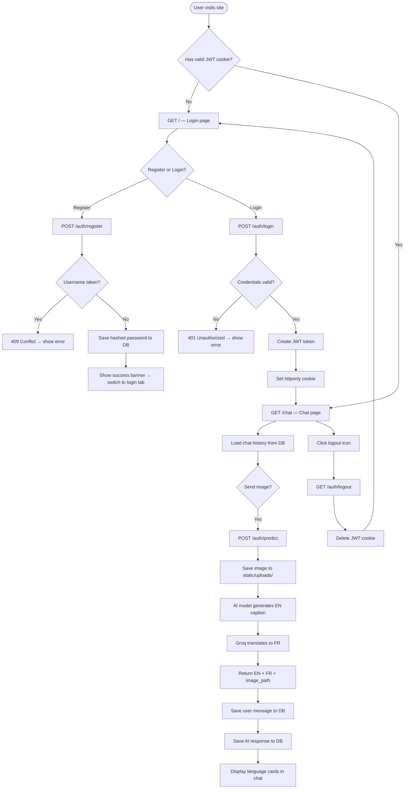
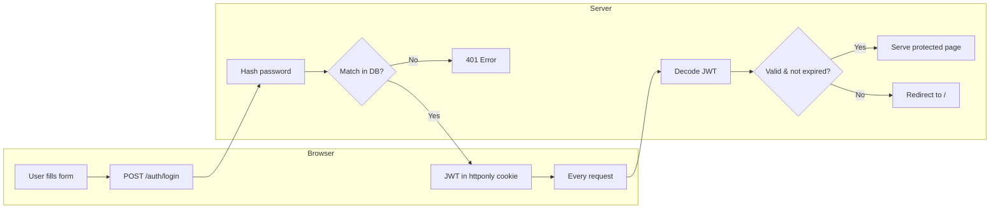
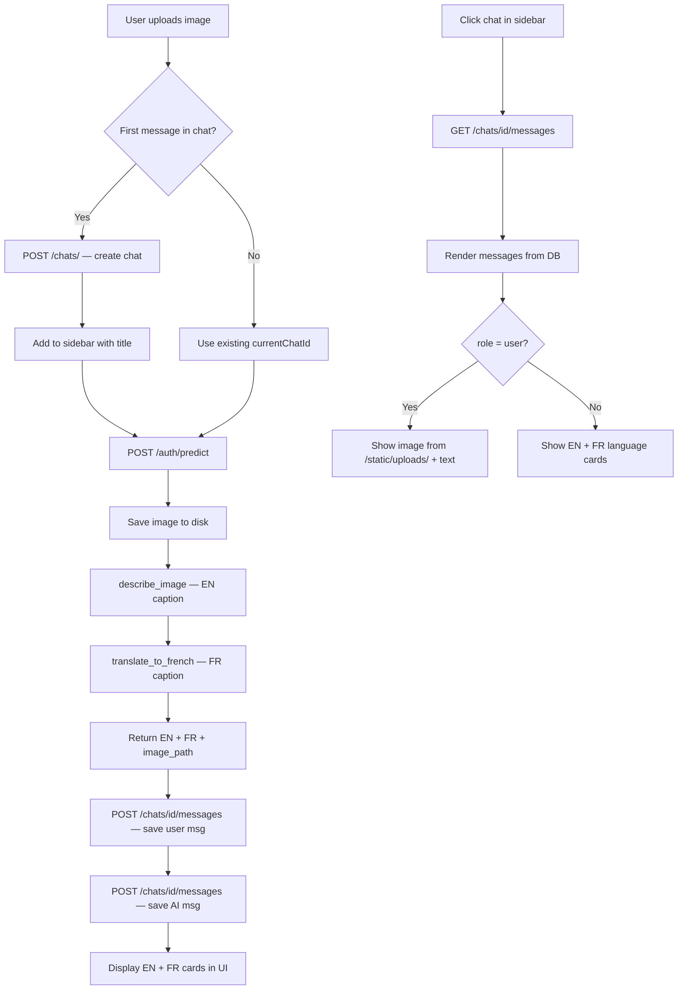

# Flow Diagrams

## Application Flow

```mermaid
flowchart TD
    A([User visits site]) --> B{Has valid JWT cookie?}
    B -- No --> C[GET / — Login page]
    B -- Yes --> D[GET /chat — Chat page]

    C --> E{Register or Login?}
    E -- Register --> F[POST /auth/register]
    F --> G{Username taken?}
    G -- Yes --> H[409 Conflict → show error]
    G -- No --> I[Save hashed password to DB]
    I --> J[Show success banner → switch to login tab]

    E -- Login --> K[POST /auth/login]
    K --> L{Credentials valid?}
    L -- No --> M[401 Unauthorized → show error]
    L -- Yes --> N[Create JWT token]
    N --> O[Set httponly cookie]
    O --> D

    D --> P[Load chat history from DB]
    P --> Q{Send image?}
    Q -- Yes --> R[POST /auth/predict]
    R --> S[Save image to static/uploads/]
    S --> T[AI model generates EN caption]
    T --> U[Groq translates to FR]
    U --> V[Return EN + FR + image_path]
    V --> W[Save user message to DB]
    W --> X[Save AI response to DB]
    X --> Y[Display language cards in chat]

    D --> Z[Click logout icon]
    Z --> AA[GET /auth/logout]
    AA --> AB[Delete JWT cookie]
    AB --> C
```

## Authentication Flow

```mermaid
flowchart LR
    subgraph Browser
        A[User fills form] --> B[POST /auth/login]
        E[JWT in httponly cookie] --> F[Every request]
    end

    subgraph Server
        B --> C[Hash password]
        C --> D{Match in DB?}
        D -- Yes --> E
        D -- No --> G[401 Error]
        F --> H[Decode JWT]
        H --> I{Valid & not expired?}
        I -- Yes --> J[Serve protected page]
        I -- No --> K[Redirect to /]
    end
```

## Chat & Image Flow

```mermaid
flowchart TD
    A[User uploads image] --> B{First message in chat?}
    B -- Yes --> C[POST /chats/ — create chat]
    C --> D[Add to sidebar with title]
    B -- No --> E[Use existing currentChatId]

    D --> F[POST /auth/predict]
    E --> F

    F --> G[Save image to disk]
    G --> H[describe_image — EN caption]
    H --> I[translate_to_french — FR caption]
    I --> J[Return EN + FR + image_path]

    J --> K[POST /chats/id/messages — save user msg]
    K --> L[POST /chats/id/messages — save AI msg]
    L --> M[Display EN + FR cards in UI]

    N[Click chat in sidebar] --> O[GET /chats/id/messages]
    O --> P[Render messages from DB]
    P --> Q{role = user?}
    Q -- Yes --> R[Show image from /static/uploads/ + text]
    Q -- No --> S[Show EN + FR language cards]
```