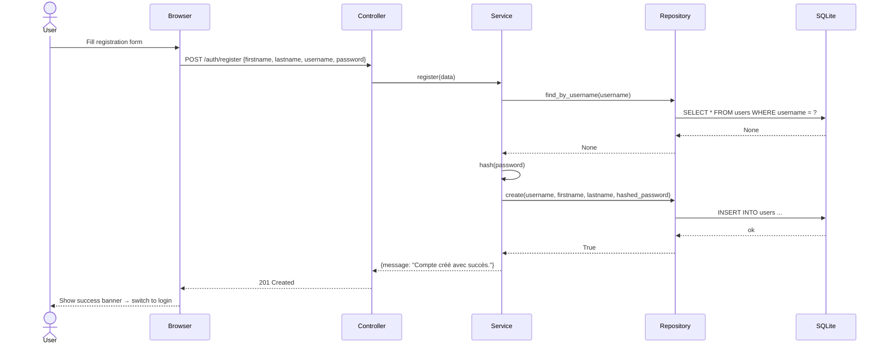
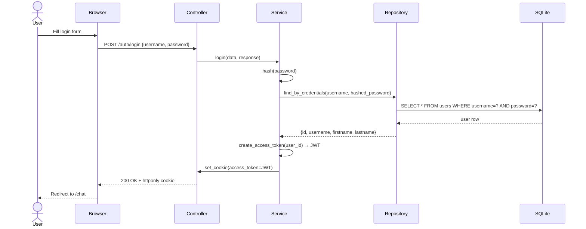
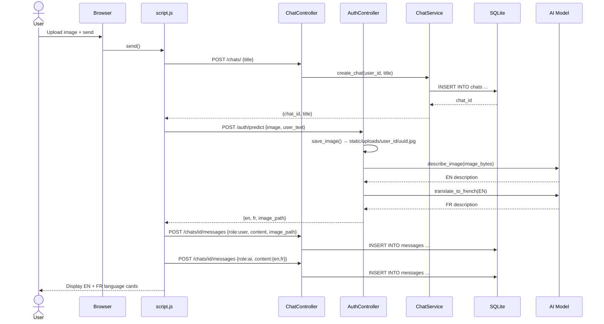
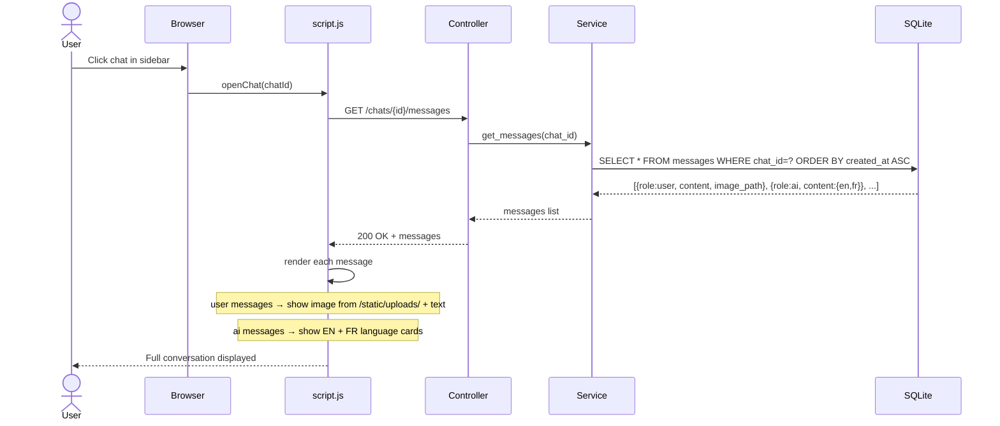
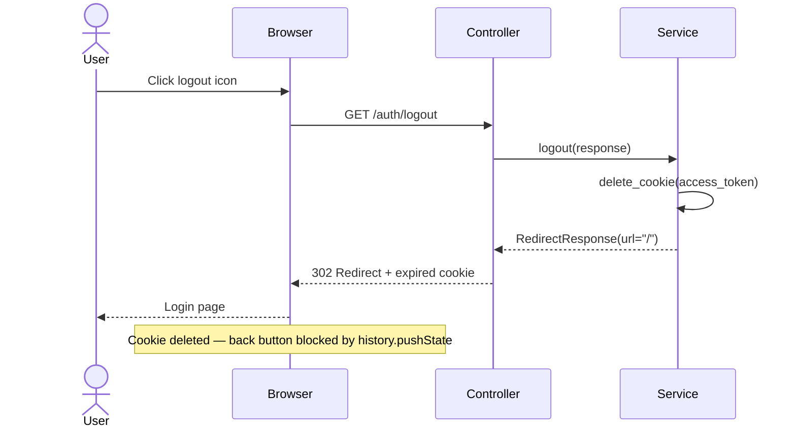

# Sequence Diagrams

## User Registration

```mermaid
sequenceDiagram
    actor User
    participant Browser
    participant Controller
    participant Service
    participant Repository
    participant DB as SQLite

    User->>Browser: Fill registration form
    Browser->>Controller: POST /auth/register {firstname, lastname, username, password}
    Controller->>Service: register(data)
    Service->>Repository: find_by_username(username)
    Repository->>DB: SELECT * FROM users WHERE username = ?
    DB-->>Repository: None
    Repository-->>Service: None
    Service->>Service: hash(password)
    Service->>Repository: create(username, firstname, lastname, hashed_password)
    Repository->>DB: INSERT INTO users ...
    DB-->>Repository: ok
    Repository-->>Service: True
    Service-->>Controller: {message: "Compte créé avec succès."}
    Controller-->>Browser: 201 Created
    Browser-->>User: Show success banner → switch to login
```

## User Login

```mermaid
sequenceDiagram
    actor User
    participant Browser
    participant Controller
    participant Service
    participant Repository
    participant DB as SQLite

    User->>Browser: Fill login form
    Browser->>Controller: POST /auth/login {username, password}
    Controller->>Service: login(data, response)
    Service->>Service: hash(password)
    Service->>Repository: find_by_credentials(username, hashed_password)
    Repository->>DB: SELECT * FROM users WHERE username=? AND password=?
    DB-->>Repository: user row
    Repository-->>Service: {id, username, firstname, lastname}
    Service->>Service: create_access_token(user_id) → JWT
    Service->>Controller: set_cookie(access_token=JWT)
    Controller-->>Browser: 200 OK + httponly cookie
    Browser-->>User: Redirect to /chat
```

## Image Prediction & Save

```mermaid
sequenceDiagram
    actor User
    participant Browser
    participant JS as script.js
    participant ChatCtrl as ChatController
    participant AuthCtrl as AuthController
    participant ChatSvc as ChatService
    participant DB as SQLite
    participant AI as AI Model

    User->>Browser: Upload image + send
    Browser->>JS: send()
    JS->>ChatCtrl: POST /chats/ {title}
    ChatCtrl->>ChatSvc: create_chat(user_id, title)
    ChatSvc->>DB: INSERT INTO chats ...
    DB-->>ChatSvc: chat_id
    ChatSvc-->>JS: {chat_id, title}

    JS->>AuthCtrl: POST /auth/predict {image, user_text}
    AuthCtrl->>AuthCtrl: save_image() → static/uploads/user_id/uuid.jpg
    AuthCtrl->>AI: describe_image(image_bytes)
    AI-->>AuthCtrl: EN description
    AuthCtrl->>AI: translate_to_french(EN)
    AI-->>AuthCtrl: FR description
    AuthCtrl-->>JS: {en, fr, image_path}

    JS->>ChatCtrl: POST /chats/id/messages {role:user, content, image_path}
    ChatCtrl->>DB: INSERT INTO messages ...
    JS->>ChatCtrl: POST /chats/id/messages {role:ai, content:{en,fr}}
    ChatCtrl->>DB: INSERT INTO messages ...
    JS-->>User: Display EN + FR language cards
```

## Load Chat History

```mermaid
sequenceDiagram
    actor User
    participant Browser
    participant JS as script.js
    participant Controller
    participant Service
    participant DB as SQLite

    User->>Browser: Click chat in sidebar
    Browser->>JS: openChat(chatId)
    JS->>Controller: GET /chats/{id}/messages
    Controller->>Service: get_messages(chat_id)
    Service->>DB: SELECT * FROM messages WHERE chat_id=? ORDER BY created_at ASC
    DB-->>Service: [{role:user, content, image_path}, {role:ai, content:{en,fr}}, ...]
    Service-->>Controller: messages list
    Controller-->>JS: 200 OK + messages
    JS->>JS: render each message
    Note over JS: user messages → show image from /static/uploads/ + text
    Note over JS: ai messages → show EN + FR language cards
    JS-->>User: Full conversation displayed

```

## Logout

```mermaid
sequenceDiagram
    actor User
    participant Browser
    participant Controller
    participant Service

    User->>Browser: Click logout icon
    Browser->>Controller: GET /auth/logout
    Controller->>Service: logout(response)
    Service->>Service: delete_cookie(access_token)
    Service-->>Controller: RedirectResponse(url="/")
    Controller-->>Browser: 302 Redirect + expired cookie
    Browser-->>User: Login page
    Note over Browser: Cookie deleted — back button blocked by history.pushState
```